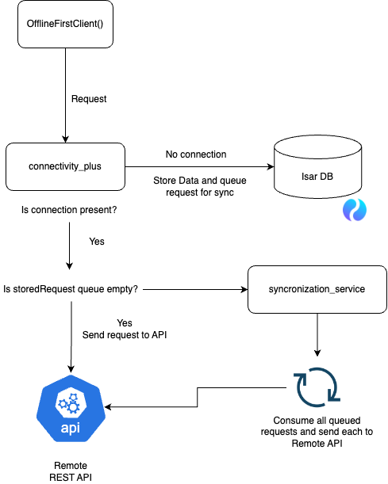

<!-- markdownlint-disable MD033 MD041 -->
<p align="center" style="margin-bottom: 0px;">
  
</p>

<h1 align="center" style="margin-top: 0px; font-size: 4em;">Panda Sync</h1>

[](https://github.com/red-panda-solutions/panda-sync/actions) [](https://pub.dev/packages/panda_sync) [](https://github.com/red-panda-solutions/panda-sync/blob/master/LICENSE)

# panda_sync

`panda_sync` is a Dart library designed to facilitate the development of offline-first applications
using Flutter. It provides seamless data synchronization between local storage and a remote server,
ensuring your app remains functional even without internet connectivity. The

## Features

- **Offline-First Functionality**: Automatically handles data synchronization when the device is
  online.
- **Local Storage with Isar**: Utilizes Isar, a high-performance NoSQL database, for local data
  storage.
- **Network Request Management**: Uses Dio for making network requests and managing connectivity
  states.
- **Type Registration**: Enforces type registration for data serialization and deserialization.
- **Automatic Retry**: Automatically retries failed network requests when the device regains
  connectivity.
- **Customizable**: Allows customization of request handling and data processing.

## How it works?

This repository implements an offline-first client for Flutter applications.
The `OfflineFirstClient` class leverages Dio for HTTP requests, Isar for local storage, and a custom
synchronization service to handle queued requests when the device is offline. Below is a diagram and
a step-by-step explanation of how it works:

<div style="text-align: center;">
    
</div>

### Explanation

1. **Request Initialization**: The process starts when the `OfflineFirstClient` initiates a request.

2. **Connectivity Check**: The `connectivity_plus` package checks whether an internet connection is
   available.

3. **No Connection**:
    - If there is no connection, the data is stored locally in the Isar database.
    - The request is queued for synchronization once the connection is restored.

4. **Connection Present**:
    - If a connection is present, the client checks if there are any stored requests in the queue.

5. **Empty Queue**:
    - If the queue is empty, the request is sent directly to the remote REST API.

6. **Non-empty Queue**:
    - If the queue is not empty, the `synchronization_service` processes all queued requests.
    - Each queued request is sent to the remote REST API.

7. **Remote REST API**:
    - The request reaches the remote REST API and gets processed.
    - The response is handled by the `OfflineFirstClient`, updating local storage as necessary.

### Key Components

- **Dio**: Used for making HTTP requests.
- **Isar**: A local database used for storing data when the device is offline.
- **connectivity_plus**: A package that provides network connectivity status.
- **Synchronization Service**: Handles queued requests and synchronizes them with the server once
  the connection is available.

By following this flow, the `OfflineFirstClient` ensures that your application remains functional
even when the network is unavailable, synchronizing data seamlessly once the connection is restored.

## Installation

Add the following dependency to your `pubspec.yaml` file:

```yaml

dependencies:
  panda_sync: ^1.0.0 # Add the latest version
```

## Usage

### Step 1: Initialize Local Storage

Before using the library, initialize Isar core:

```dart

import 'package:panda_sync/panda_sync.dart';

void main() async {
  await OfflineFirstLocalStorageInit.initialize();
  runApp(MyApp());
}
```

## Step 2: Extend your data models with `Identifieble` and implement static `fromJson` and `toJson` methods.

```dart
import 'package:panda_sync/panda_sync.dart';

import 'package:json_annotation/json_annotation.dart';

part 'task_model.g.dart';

//This example uses json_serializable but this is not mandatory
@JsonSerializable()
class Task extends Identifiable {
  @override
  int id;

  ...

  factory Task.fromJson(Map<String, dynamic> json) => _$TaskFromJson(json);

  static Map<String, dynamic> taskToJson(Task task) => _$TaskToJson(task);
}

```

### Step 3: Register the types your app will use:

```dart

import 'package:panda_sync/panda_sync.dart';
import 'model/task_model.dart'; // Import your model

void main() async {
  await OfflineFirstLocalStorageInit.initialize();

  TypeRegistry.register<Task>('TaskBox', Task.taskToJson, Task.fromJson);

  runApp(MyApp());
}

```

### Step 4: Register token handler

Use the `registerTokenHandlers` method to provide functions for obtaining and refreshing the token.

```dart
configureClient() {
  final client = OfflineFirstClient();

  client.registerTokenHandlers(
    getTokenHandler: () async {
      // Retrieve the token from secure storage or any other source
      return 'your-access-token';
    },
    refreshTokenHandler: () async {
      // Implement the logic to refresh the token
    },
  );
}
```

If a request returns any 401 Unauthorized error, the library will call the provided refresh token
handler, update the token, and retry the request.

### Step 5: Create an Instance of `OfflineFirstClient`

Create an instance of OfflineFirstClient:

```dart

final OfflineFirstClient offlineFirstClient =
OfflineFirstClient();
```

### Step 5: Use the `OfflineFirstClient` as you would use any other Http client

Here's how to use the library in a service class:

```dart
  getTasks() {
  OfflineFirstClient offlineFirstClient = OfflineFirstClient();

  offlineFirstClient.registerTokenHandlers(getTokenHandler: () async {
    // Retrieve the token from secure storage or any other source
    return 'your-access-token';
  }, refreshTokenHandler: () async {
    // Implement the logic to refresh the token
  });
  try {
    Response<List<Task>> response = await offlineFirstClient.getList<Task>(
        'http://10.0.2.2:8080/api/tasks');
    return response.data!;
  } catch (e) {
    throw Exception('Failed to load tasks: $e');
  }
}
```

# Documentation

Please refer to the code documentation for extensive info on the methods

# Contributing

We welcome contributions! Please follow these steps to contribute:

    1. Fork the repository.
    2. Create a new branch (`git checkout -b my-feature-branch`).
    3. Make your changes.
    4. Commit your changes (`git commit -am 'Add new feature'`).
    5. Push to the branch (git push origin my-feature-branch).
    6. Create a Pull Request.

# License

This project is licensed under the MIT License - see the LICENSE file for details.

# Acknowledgements

- [Isar Database](https://github.com/isar/isar)
- [Dio HTTP Client](https://github.com/cfug/dio)
- [Connectivity Plus](https://github.com/fluttercommunity/plus_plugins/tree/main/packages/connectivity_plus/connectivity_plus)
- [Flutter Data](https://github.com/flutterdata/flutter_data)

# Contact

For any questions or suggestions, feel free to open an issue or contact any maintainer.
